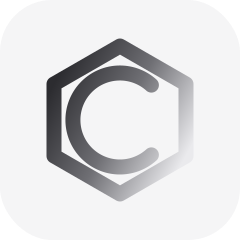

<p align="center">
  
</p>

<h1 align="center">Chimaera</h1>

<p align="center"><strong>Your agent workbench.</strong></p>

<p align="center">
  Claude Code, Codex, and friends as persistent, daemon-owned sessions on whatever host owns<br>
  the work — your laptop, a dev server, or an HPC login node. Run them in parallel, drive each<br>
  from a rich chat UI or its real terminal, and close the laptop mid-run — nothing dies.
</p>

<p align="center">
  <a href="https://chimaera.sh/"><strong>Website</strong></a>
  &nbsp;·&nbsp;
  <a href="https://chimaera.sh/docs.html">Docs</a>
  &nbsp;·&nbsp;
  <a href="https://github.com/martinappberg/chimaera/releases/latest">Download</a>
</p>

<p align="center">
  <a href="LICENSE"></a>
  
  
</p>

---

Chimaera is a workbench, not an IDE — no LSP, no debugger, no completions. The job is
different: run many coding agents at once, keep them alive on the host that owns the work, and
see what they produced. One static Rust binary is the whole server; the client is a web UI it
serves itself, plus a native app that wraps the same UI in real windows. The daemon owns the
sessions; windows are just views. Close the laptop mid-run and nothing happens — reconnect and
every session is exactly where you left it.

Each agent runs one of two ways on the same session, a toggle apart. In **chat mode** (the
default) Chimaera drives the agent over its structured JSON protocol and renders a first-class
chat UI — streamed thinking, tool cards, permission prompts, rewind, and inline previews of the
files each turn produced. Flip to the **real TUI** and the same agent runs as its actual
`claude`/`codex` terminal in a daemon-owned PTY, looking, behaving, and billing exactly like
your subscription terminal.

## Why

The usual way to run coding agents on a remote machine is a two-tool split: code-server in a
browser tab for looking at files, and tmux over SSH for keeping the agents alive — with all
the misery of nesting one inside the other. Browser terminals die on reload; tmux renders
nothing. The deliverable of an agent session is usually *files* — reports, plots, tables —
not the conversation, and no existing tool puts the sessions and their outputs in one window
that survives disconnection. Chimaera replaces that whole stack.

## Quickstart

Build from source. You need stable Rust and Node.

```sh
git clone https://github.com/martinappberg/chimaera
cd chimaera
npm --prefix web-ui install
npm --prefix web-ui run build      # the daemon embeds web-ui/dist
cargo build --release -p chimaera
```

Run it locally:

```sh
chimaera serve                     # starts the daemon, prints the UI URL
```

Run it on a remote host (an HPC login node, a dev server — anything you can ssh to):

```sh
just dist                          # one-time: build linux-musl binaries into ~/.chimaera/dist
chimaera connect <host>            # install-if-missing, start-or-attach, tunnel, open the UI
```

`connect` shells out to your system `ssh`, so `ProxyJump`, `ControlMaster`, and 2FA from
`~/.ssh/config` all just work. The daemon installs into `~/.chimaera` on the host — no root,
no containers, nothing else to set up.

If you use [just](https://github.com/casey/just), `just serve` does the UI build + daemon run
in one step, and `just app-build` bundles the native app.

## Features

- **Sessions that survive disconnect.** tmux-grade ownership: the daemon holds every PTY with
  full server-side terminal state. Reload, reconnect, or reattach from another machine and you
  get the identical screen back — no lost scrollback, no broken reconnect tokens.
- **Chat mode or the real TUI.** Every agent runs two ways on one session, a toggle apart. Chat
  mode (the default) is a rich structured UI — streamed thinking, tool cards, permission
  prompts, rewind, and inline previews of what each turn produced. Flip to the real
  `claude`/`codex` TUI and it looks, behaves, and bills exactly like your subscription terminal.
- **Multi-agent launcher.** Claude Code, Codex, Gemini CLI, and Antigravity CLI in one
  launcher: detected if installed, resumable per workspace, and installable/updatable from
  official sources through the UI — binaries live under `~/.chimaera`, credentials stay entirely
  yours. Run several at once; attention state tells you which one needs you.
- **File previews.** Images, Markdown, CSV/TSV (gzip included), PDF, notebooks, and sandboxed
  self-contained HTML reports — the MultiQC/FastQC class of scientific outputs that normally
  forces a code-server install. Server extracts, client renders, whole files are never loaded.
- **Git, built in.** A source-control panel with side-by-side diffs, worktree create/remove, a
  branch per agent, and a session-scoped view of exactly what an agent changed — the review side
  of git, without leaving the workbench.
- **Linked terminals.** Hand an agent a leash to a live shell — the one with your environment
  already loaded — instead of paying setup cost per command. Links are user-granted, scoped,
  and audited in the terminal's own scrollback.
- **A real workbench layout.** Split panes, tabs, drag-and-drop, focus mode, and a session strip
  that always says where you are — with curated light/dark themes injected into the agents' own
  TUIs so everything matches.
- **Native app.** A Tauri shell wraps the same UI: a window per workspace, a home screen of
  workspaces and remote hosts with one-click connect. Quitting the app kills nothing.

## Platforms

macOS and Linux. The daemon cross-compiles to fully static musl binaries (x86_64 and aarch64)
that run on old-glibc HPC systems — verified on a cluster running glibc 2.17, no root
required. Windows is untested.

## Staying current

Two things update themselves, so a running setup keeps pace with releases:

- **The daemon** is replaced on connect when it is older than the client — silently if it
  has no live sessions, otherwise behind an explicit "update" action that spells out what
  it ends (an idle shell holding a `module load`/conda environment is never killed without
  asking). Works the same for the local daemon and remote ones over ssh.
- **The native app** checks GitHub releases on launch and offers a one-click "update &
  restart"; the download is signature-verified before it installs.

## Status

Early and pre-release, moving fast. Interfaces, storage formats, and the wire protocol all
change without notice. See [DESIGN.md](DESIGN.md) for the full design and roadmap.

## Development

The workspace is a Rust daemon (`crates/`) plus a Svelte web UI (`web-ui/`) it embeds, and a
standalone Tauri app (`crates/chimaera-app`). Start here:

- **[CLAUDE.md](CLAUDE.md)** — the fast orientation map: repo layout, the dev loop, working
  rules, and how releases work. Read it first, whether you're a person or an agent.
- **[CONTRIBUTING.md](CONTRIBUTING.md)** — dev setup, code style, verification culture, the CLA.
- **[DESIGN.md](DESIGN.md)** — the design spine: problem, product model, scope, roadmap,
  decisions log. It links to the deep **[architecture guide](docs/agent-guides/architecture.md)**
  (the source of truth for how it's built and why).

```sh
just check      # fmt + clippy + test — the same gate CI runs
just serve      # build the UI and run the daemon locally
just dev-ui     # Vite dev server against a running daemon (develop on :5173)
```

A releasing merge to `main` cuts a published release; the version is bumped from the
squash-merge **subject** (Conventional Commits — `feat:` → minor, `fix:` → patch, `!` →
major; `refactor:`/`chore:`/`docs:` and `[skip release]` ship nothing). Full rules:
[docs/agent-guides/releases.md](docs/agent-guides/releases.md).

## License

Chimaera is licensed under the [GNU AGPL-3.0](LICENSE) — free for everyone to use, self-host,
and modify. If you want to build a closed-source product or service on Chimaera, a commercial
license is available: contact mkjberg@gmail.com.

Contributions require a CLA (see [CONTRIBUTING.md](CONTRIBUTING.md)).
