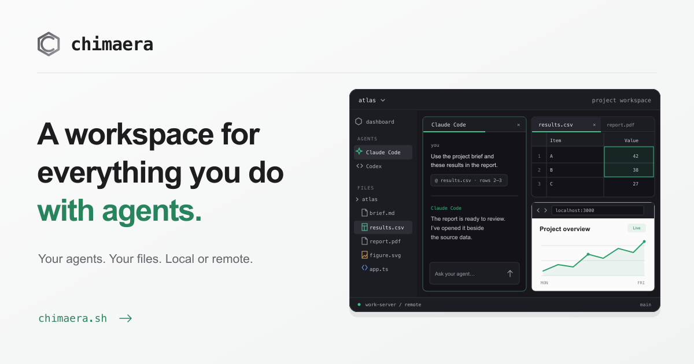

<p align="center">
  <a href="https://chimaera.sh/">
    
  </a>
</p>

<p align="center">
  <a href="https://chimaera.sh/#download"><strong>Download</strong></a>
  &nbsp;·&nbsp;
  <a href="https://chimaera.sh/#workspace">Explore the workspace</a>
  &nbsp;·&nbsp;
  <a href="https://chimaera.sh/docs.html">Docs</a>
  &nbsp;·&nbsp;
  <a href="docs/agent-guides/plugins.md">Build an extension</a>
</p>

<p align="center">
  <a href="https://github.com/martinappberg/chimaera/releases/latest"></a>
  <a href="LICENSE"></a>
  
</p>

Chimaera is an open-source **agent workbench**. Open a project folder and put your
agents, files, and tools side by side. Read a document while an agent works on it.
Inspect a table, review a diff, or run a web app beside the conversation. Work on
your own machine or connect to a remote host.

It runs your own **Claude Code, Codex, Antigravity, or Grok Build**, with the
accounts, skills, and connections configured on that host. Your agents do the
work. Chimaera gives you a place to direct it, see the results, and keep the
project in view.

[Get started](#get-started) · [Inside the workspace](#inside-the-workspace) ·
[Run from the command line](#run-from-the-command-line) · [Build from source](#build-from-source) ·
[Development](#development)

## Get started

1. **[Download the native app](https://chimaera.sh/#download).** It bundles the
   daemon and provides signed updates.
2. **Open a folder**, locally or on a remote host. The app opens a workspace around it.
3. **Choose an agent.** Use the launcher to install a supported CLI if needed,
   sign in with its provider, and start a conversation.
4. **Open the output beside the chat.** Arrange panes, reference files, and bring
   another agent into the same project when you need one.

| Platform | Native app |
|---|---|
| macOS | Apple Silicon, `.dmg` |
| Linux | x86_64, AppImage, `.deb`, or `.rpm` |
| Windows | x64 installer, with the daemon and agents running in WSL2; beta |

[Installation and platform setup](https://chimaera.sh/docs.html#platforms) ·
[All releases](https://github.com/martinappberg/chimaera/releases)

## Inside the workspace

### Your agents, working together

Keep several agents in the same project. Use structured chat or an agent terminal,
see questions and approvals in the dashboard, and follow recent activity. Agents
can exchange messages within the workspace. An optional **Mastermind** coordinator
helps brief you and direct the work.

All four supported agents have structured chat. Claude Code and Codex also let you
switch the same conversation between chat and their real terminal interfaces.
Provider authentication, usage limits, and billing apply to the mode you use.

[Agents](docs/features/agents.md) · [Coordination](docs/features/agent-communication.md)

### Files you can see and work with

Open Markdown, PDFs, Word documents, spreadsheets, slide decks, tables, images,
notebooks, diagrams, video, audio, and HTML reports. Keep a live web app in a
browser pane. Edit text and Markdown directly. Give an agent a file reference,
text selection, table cell, image region, or media timestamp as context.

The file manager handles uploads, downloads, moves, and copies. Git views bring
status, diffs, history, and worktrees into the workspace. Session history records
changes even in folders without a Git repository.

[Files and previews](docs/features/files-and-previews.md) ·
[Browser panes](docs/features/browser-pane.md) · [Git](docs/features/git.md)

### Project context, close to the work

Follow activity in Timeline and catch up through the dashboard. Keep source files,
notes, and decisions beside the conversation. Knowledge extensions make findings,
decisions, and handoffs recorded in project files browsable in the workspace.

[Timeline and Knowledge](docs/features/timeline-and-knowledge.md) ·
[Dashboard](docs/features/dashboard.md) · [Session history](docs/features/session-history.md)

### Local folders and remote machines

Connect through your existing SSH configuration. Chimaera installs its server on
the remote host and opens the workspace through a tunnel. Files, agents, and tools
run on that host. On Slurm clusters, start a job and open workspaces on its compute
node from the same app.

[SSH connections](docs/features/remote-connect.md) · [Slurm workspaces](docs/features/compute.md)

### A workspace you can extend

Extensions add views, file viewers, and tools for your agents. Workbench plugins
are WebAssembly components installed separately and enabled per workspace. They
can reuse Chimaera's UI, publish project context and diagnostics, and expose tools
to agents through declared capabilities. The Extensions view also brings together
your agents' plugins, skills, and connections.

[Using extensions](docs/features/plugins.md) ·
[Extension authoring guide for people and agents](docs/agent-guides/plugins.md)

## Run from the command line

The standalone `chimaera` binary serves the same web UI as the native app. Download
it for your host from the [latest release](https://github.com/martinappberg/chimaera/releases/latest)
and make it executable. For example, on **Linux x86_64**:

```sh
curl -fL https://github.com/martinappberg/chimaera/releases/latest/download/chimaera-x86_64-unknown-linux-musl -o chimaera
chmod +x chimaera
./chimaera serve
```

Open the `http://127.0.0.1:…/#token=…` URL printed in the terminal. The daemon binds
to loopback and chooses a free port; use `serve --port 9700` to choose one yourself.
The agent CLIs run on this host and need their own installation and provider login.

With `chimaera` on your `PATH`, connect to a remote host using its SSH alias:

```sh
chimaera connect work-server
```

Chimaera deploys a matching server, starts it, and opens a tunnel. Remote deployment
requires no root access or containers. Static Linux binaries support x86_64 and
aarch64 without a system glibc dependency. Scheduler-equipped hosts use the
[cluster workflow](docs/features/compute.md) to run workspaces inside Slurm jobs.

Useful commands:

```sh
chimaera status                 # inspect the local daemon
chimaera status work-server     # inspect a remote host
chimaera doctor                 # check local paths and prerequisites
chimaera plugin list            # list available and installed workbench plugins
```

[CLI reference](docs/features/cli.md) · [Remote setup](https://chimaera.sh/docs.html#connect)

## Build from source

You need **Node 22**, npm, Rust through **rustup**, and a C/C++ build toolchain.
The repository pins Rust in [rust-toolchain.toml](rust-toolchain.toml); rustup
selects it automatically. Run these commands on macOS, Linux, or inside WSL2 on
Windows. Build the UI first because the daemon embeds it.

```sh
git clone https://github.com/martinappberg/chimaera
cd chimaera
npm --prefix web-ui ci
npm --prefix web-ui run build
cargo build --locked --release -p chimaera
./target/release/chimaera serve
```

A source checkout uses isolated development state under `~/.chimaera-dev` until
release version stamping. It does not share the installed app's state. Building
or running the daemon does not require building plugins.

The native app is a separate Tauri workspace in `crates/chimaera-app`. See
[contributor setup](.github/CONTRIBUTING.md) for native development and verification.

## Development

The server is Rust, the web UI is Svelte 5, and the native shell is Tauri 2.
The same daemon and web UI power local and remote workspaces.

| Directory | Contents |
|---|---|
| [`crates/`](crates/) | CLI, daemon, PTY engine, agent protocols, remote connections, plugin API, and native app |
| [`web-ui/`](web-ui/) | Svelte workspace UI |
| [`plugins/`](plugins/) | Curated plugin lock and host test fixtures; released plugins live in their own repositories |
| [`site/`](site/) | Public website and usage docs |
| [`docs/`](docs/README.md) | Feature guides, developer guides, and design records |
| [`scripts/`](scripts/) | Build, verification, and repository maintenance tools |

After the UI build above, install [just](https://github.com/casey/just) and run:

```sh
npm --prefix web-ui run check   # Svelte and TypeScript checks
npm --prefix web-ui run test    # targeted Vitest suites
just check                     # plugin test assets, then Rust fmt, clippy, and tests
node scripts/check-doc-links.mjs
node scripts/check-agent-assets.mjs
```

For an isolated daemon or native-app preview, follow the
[development workflow](.claude/skills/develop/SKILL.md). It gives the checkout its
own state and port. The [contributing guide](.github/CONTRIBUTING.md) covers the
full loop and the checks required for each kind of change.

- **Changing the application:** start at [AGENTS.md](AGENTS.md), then read the
  relevant area map and [feature guide](docs/features/README.md).
- **Building an extension:** use the [extension authoring guide](docs/agent-guides/plugins.md),
  including the starter component, local install, permissions, and verification.
- **Adding an agent integration:** read the [integration guide](docs/agent-guides/agent-integrations.md)
  and the [protocol reference](crates/chimaera-agent/PROTOCOL.md).
- **Understanding the design:** read the [architecture guide](docs/agent-guides/architecture.md).
  Dated proposals and decisions live under [docs/design](docs/design/README.md).

## License

Chimaera is licensed under the [GNU AGPL-3.0](LICENSE). A commercial license is
available for closed-source products and services: [contact the author](mailto:mkjberg@gmail.com).
Contributions require the [Contributor License Agreement](CLA.md); see
[contributing](.github/CONTRIBUTING.md) for the process.
